# Vue Hello World With WebStorm

## 使用 WebStorm 来创建 Vue 项目
点击 File --> New --> Project --> Vue.js 然后依次配置即可，步骤如下:   
  1. 新建项目:  
      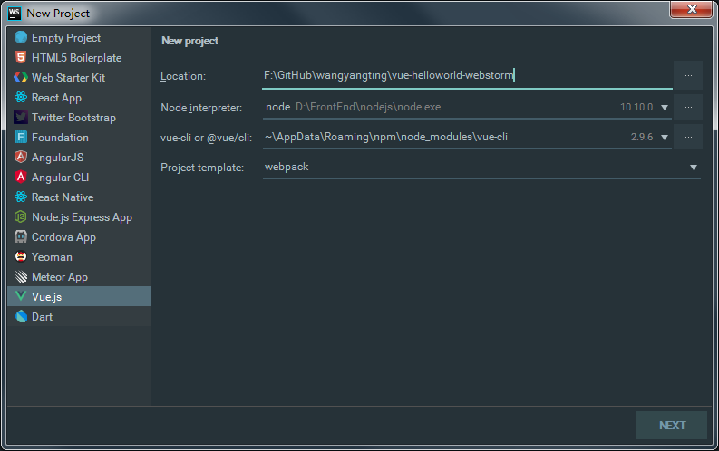
  2. 项目名称:  
     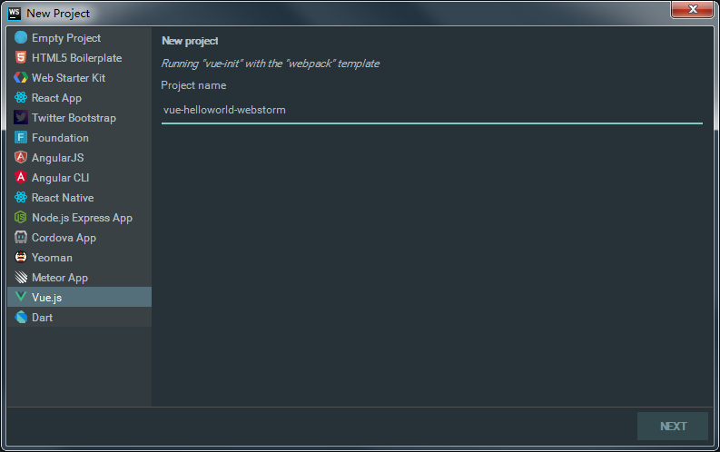
  3. 项目描述:  
      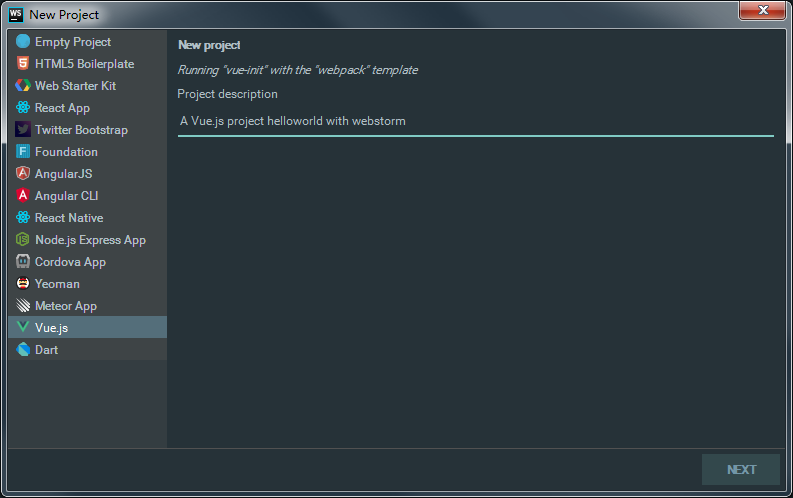
  4. 项目作者:  
      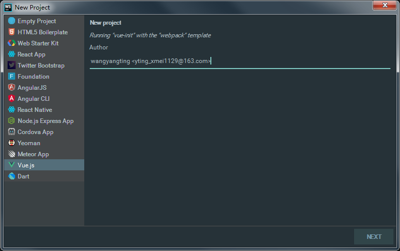
  5. Vue 构建:  
      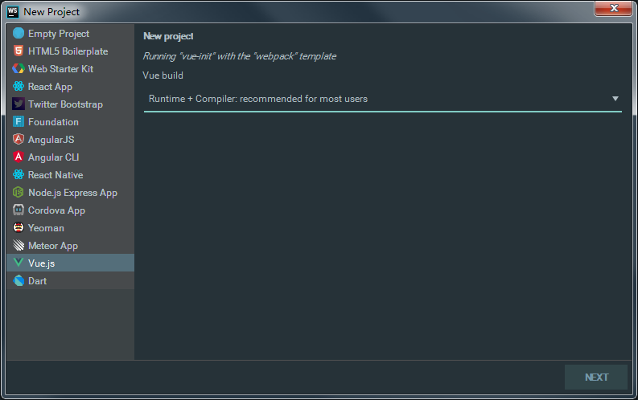
  6. 安装 vue-router:  
      
  7. 使用 ESLint:  
      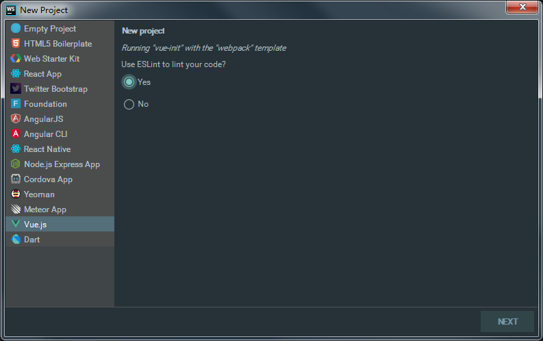
  8. 选择一个预设值的 ESLint:  
      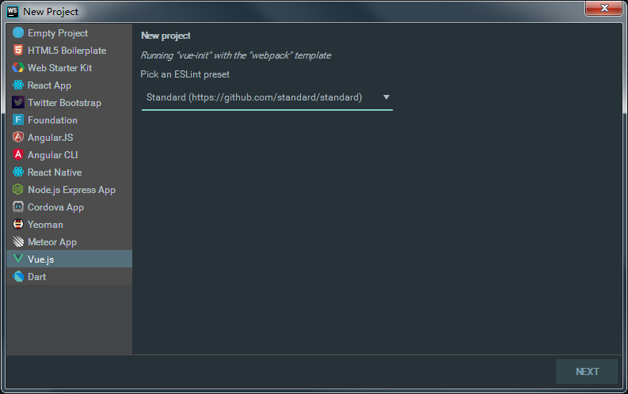
  9. 安装单元测试 unit tests:  
      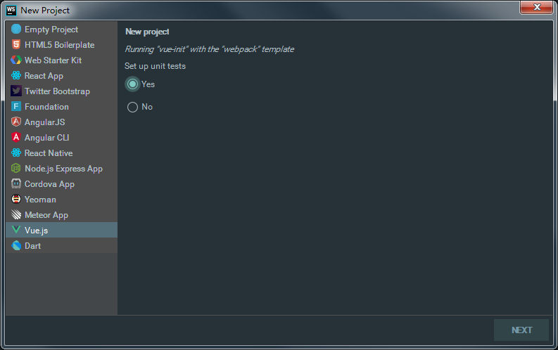
  10. 选择测试运行器 test runner:  
      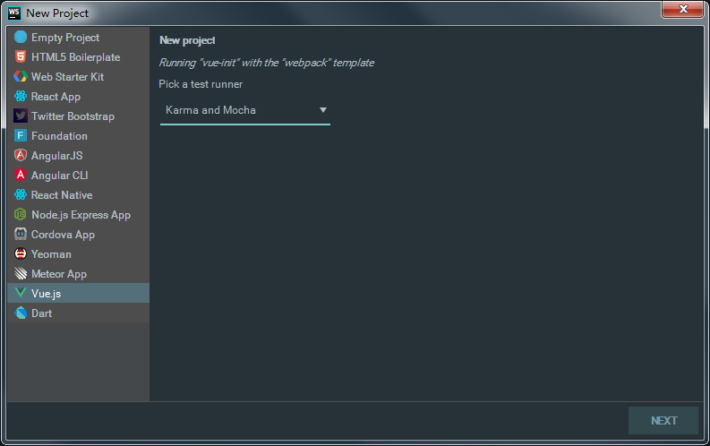
  11. Setup e2e tests with Nightwatch:  
      
  12. 使用 NPM:  
      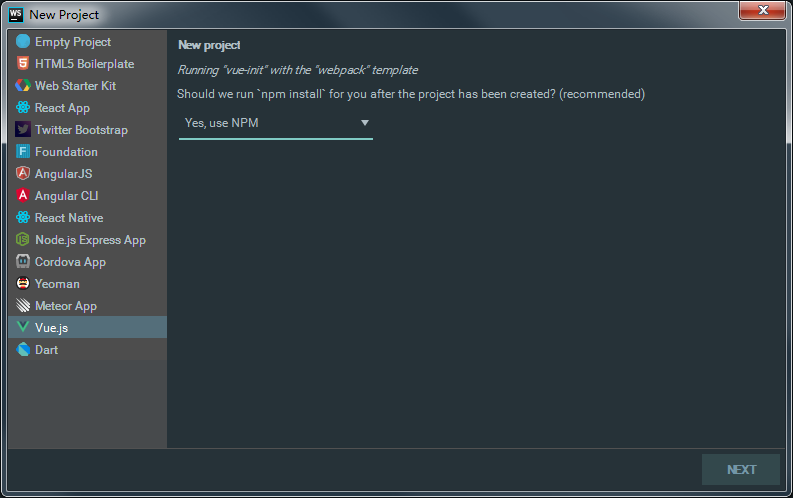
  13. 最终项目结构如下:  
      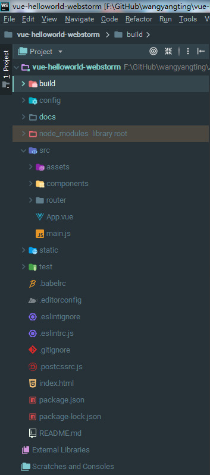
    
## 查看 package.json 中的 scripts
```json
"scripts": {
    "dev": "webpack-dev-server --inline --progress --config build/webpack.dev.conf.js",
    "start": "npm run dev",
    "unit": "cross-env BABEL_ENV=test karma start test/unit/karma.conf.js --single-run",
    "e2e": "node test/e2e/runner.js",
    "test": "npm run unit && npm run e2e",
    "lint": "eslint --ext .js,.vue src test/unit test/e2e/specs",
    "build": "node build/build.js"
  }
```
从上面的 scripts 中可以看出，IDE 已经帮我们生成了一些可用的命令（比如，dev start test），无须我们再手动写一遍了，节省时间。

## 运行项目
  1. 命令行输入 `num run dev`
  2. 浏览器访问: <http://localhost:8080> 之后，会出来 VUE 的图标以及几个链接，即表示成功，如下图所示:  
      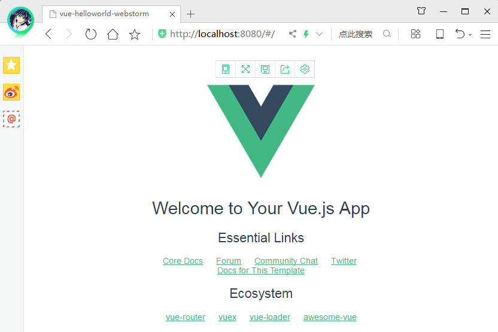
  3. 补充: 也可以使用 IDE 右键项目的 `package.json --> Show npm Scripts，然后单击 dev 即可运行`。（跟我们手动输入 npm run dev 效果是一样的）。

## 参考
<https://blog.csdn.net/weixin_40760196/article/details/79952652>
